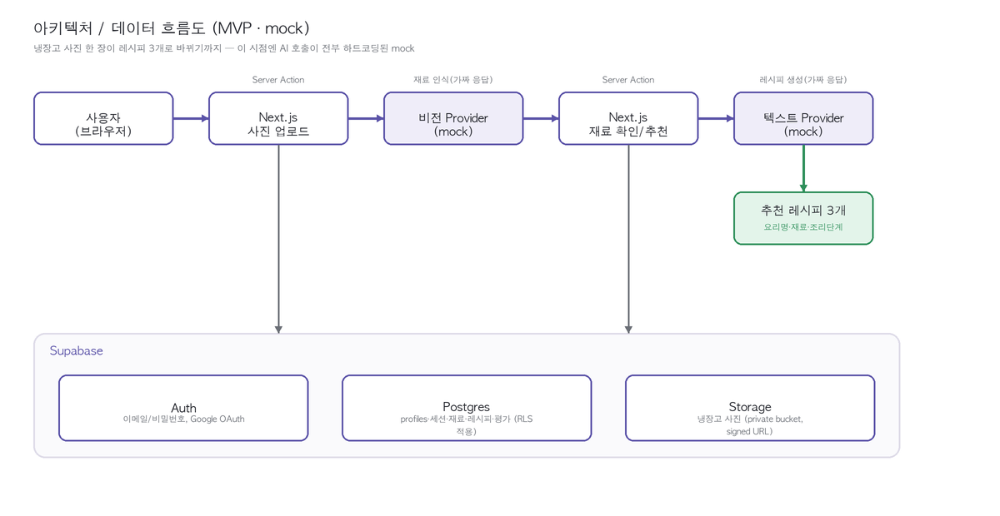

# PRD: recipe4fridge_pic

## 1. 개요

냉장고 사진을 업로드하면 AI가 식재료를 인식하고, 사용자의 선호 조건을 반영해 레시피를 추천하는 웹 앱.

- **비전 AI**: 사진 → 식재료 종류/양 추정
- **텍스트 AI**: 식재료 + 선호 조건 → 레시피 추천
- **인증**: 회원가입/로그인 후 이용, 선호 조건과 추천 기록을 계정에 저장



## 2. 목표와 범위

| 구분 | 포함 |
|---|---|
| 목표 | 사진 몇 장으로 "오늘 뭐 해먹지"에 대한 실용적 답을 빠르게 제공 |
| 비목표 (초기 범위 제외) | 정확한 칼로리 계산, 재고 관리(유통기한 알림 등), 모바일 네이티브 앱 |

## 3. 기술 스택

- **프론트/백엔드**: Next.js (App Router), Vercel 배포
- **인증/DB/스토리지**: Supabase (Auth, Postgres, Storage)
- **AI 연동**: OpenRouter 등 무료 API 제공처, 비전/텍스트 모델 각각 사용자가 선택 가능한 구조 — 이 시점엔 실제 API 키 없이 하드코딩된 mock 구현으로 전체 파이프라인만 먼저 완성
- **CI/CD**: GitHub 저장소 연동 + Vercel 자동 배포

## 4. 사용자 흐름

1. **가입/로그인** — Google OAuth 또는 이메일/비밀번호 (Supabase Auth)
2. **선호 조건 설정** (최초 1회, 이후 마이페이지에서 수정) — 요리 종류(한식/양식/중식/일식), 매운맛 선호도, 조리 난이도, 조리 소요 시간 등
3. **냉장고 사진 업로드** — 이미지 1~3장 업로드 (용량이 크면 자동 축소 후, 여러 장을 한 파일로 합쳐 AI에 전달)
4. **식재료 인식 결과 확인** — 인식된 식재료 목록(종류/수량 추정치) 표시, 사용자가 추가/수정/삭제 가능
5. **레시피 추천 요청** — 확정된 식재료 + 선호 조건으로 레시피 3개 추천받음. 이 화면에서 요리 종류/매운맛/난이도/시간 값을 "이번 요청에 한해서만" 임시로 바꿔 재요청 가능 (계정의 기본 선호 조건은 변경되지 않음)
6. **레시피 상세 확인, 평가, 저장** — 레시피별로 좋아요/싫어요와 평가 코멘트 남기기, 마음에 드는 레시피는 계정에 저장, 이후 "추천받았던 레시피" 목록에서 재확인

## 5. 기능 요구사항

### 5.1 인증 및 회원 관리
- Google OAuth 로그인
- 이메일/비밀번호 회원가입, 로그인, 로그아웃
- 비밀번호는 Supabase Auth가 관리 (직접 저장/해싱하지 않음)

### 5.2 선호 조건 (사용자 프로필)
- 요리 종류 (한식/양식/중식/일식 중 **단일 선택**) — 화면 단순성을 위해 다중 선택은 지원하지 않기로 결정 (마이페이지/세션 오버라이드 모두 단일 선택 `<select>`로 구현됨)
- 매운맛 선호도 (예: 안 매움/보통/매움)
- 조리 난이도 선호 (쉬움/보통/어려움)
- 조리 소요 시간 선호 (예: 15분 이내/30분 이내/제한 없음)
- 디자인 테마 선택 (2~3종 중 택1)
- 계정 기본값과 별개로, 레시피 추천 화면에서 **이번 세션에 한해** 위 조건들을 임시로 덮어써서 재요청 가능 (세션 오버라이드)

### 5.3 식재료 인식
- 이미지 업로드 (jpg/png), 최대 3장까지 업로드 가능
- 클라이언트에서 업로드 전 이미지 용량이 크면 자동 축소(리사이즈/압축) 후 전송
- 여러 장을 업로드한 경우 앱이 이미지를 하나로 합쳐(예: 그리드로 이어붙이기) 비전 AI에 1회 호출로 전달
- 선택된 비전 AI API 호출 → 식재료명 + 추정 수량 목록 반환 — **현재는 mock Provider가 고정된 예시 데이터를 반환**
- 인식 결과에 대한 수동 추가/수정/삭제 UI
- 비전 API 제공처를 설정 화면에서 선택 가능 (API별 특성/한도 간단 안내 포함)

### 5.4 레시피 추천
- 확정된 식재료 목록 + 선호 조건(또는 세션 오버라이드 값)을 프롬프트로 구성해 텍스트 AI 호출
- 기본 3개 레시피 추천, "다른 레시피 더 보기(재요청)" 버튼으로 추가 요청 가능
- 레시피 결과: 요리명, 필요 재료, 조리 단계, 예상 소요 시간 포함
- 텍스트 AI API 제공처를 설정 화면에서 선택 가능
- 추천 결과 저장 (즐겨찾기), 저장 목록 조회/삭제

### 5.5 디자인 테마
- 3개 테마 모두 구현하여 마이페이지에서 자유롭게 선택/변경 가능 (하나를 대표 시안으로 확정하는 것이 아니라 3종 전체를 제공)
  - `apricot` (달콤 살구) — 비대칭 라운드 + 코랄 포인트
  - `greens` (프레시 그린스) — 마켓 태그 스타일 + 그린 포인트
  - `bakery` (선샤인 베이커리) — 스캘럽 카드 + 버터옐로우/네이비
- 기본값은 `apricot`, 가입 시 자동 적용되며 이후 마이페이지에서 언제든 변경 가능
- 3개 테마는 색상/모서리 스타일 등을 CSS 커스텀 프로퍼티(토큰)로 분리해 구현 — 화면 컴포넌트는 테마 값에 관계없이 동일한 마크업 재사용

### 5.6 레시피 평가 및 관리자 집계
- 사용자는 추천받은 레시피마다 좋아요/싫어요와 평가 코멘트(텍스트)를 남길 수 있음
- 평가는 저장 여부와 무관하게 남길 수 있음 (저장 안 한 레시피도 평가 가능)
- 관리자 계정(`profiles.is_admin = true`)은 별도 대시보드에서 레시피별/기간별 좋아요·싫어요 비율과 코멘트 목록을 집계 조회 가능
- 관리자 대시보드는 일반 사용자에게는 노출되지 않음 (권한 분리 필요, 8.1 보안 참고)

## 6. 데이터 모델 (초안)

```
users                (Supabase Auth 기본 제공 테이블 사용)

profiles             id(=user_id, FK), cuisine_type, spice_level, difficulty, time_limit,
                     theme(enum: apricot/greens/bakery, default apricot),
                     is_admin(bool, default false), created_at

fridge_sessions      id, user_id(FK), vision_provider, created_at
                     -- 사진 업로드 1회(최대 3장)를 하나의 세션으로 취급

fridge_images        id, session_id(FK), image_url, original_size_bytes,
                     resized(bool), display_order

detected_ingredients id, session_id(FK), name, quantity_text, is_user_edited

recipe_requests      id, session_id(FK), user_id(FK), text_provider,
                     cuisine_override, spice_override, difficulty_override, time_override,
                     requested_count, created_at
                     -- override 필드는 세션 한정 임시 선호값 (NULL이면 프로필 기본값 사용)

recipes              id, request_id(FK), title, ingredients_json, steps_json,
                     est_time_minutes, created_at

saved_recipes        id, user_id(FK), recipe_id(FK), saved_at

recipe_feedback      id, recipe_id(FK), user_id(FK), reaction(enum: like/dislike),
                     comment_text, created_at
                     -- 관리자 집계 화면은 이 테이블을 레시피별/기간별로 GROUP BY 하여 조회
```

## 7. API / AI 연동 설계

- **추상화 계층**: `VisionProvider` / `TextProvider` 인터페이스를 두고, 각 무료 API(OpenRouter 경유 모델 등)를 구현체로 연결
  - 예: `OpenRouterVisionProvider`, `OpenRouterTextProvider` — 이후 다른 무료 제공처 추가 시 인터페이스만 구현하면 됨
  - **이 시점의 실제 구현은 `MockVisionProvider`/`MockTextProvider`** — 인터페이스만 확정하고, 실제 API 키 없이도 전체 화면 흐름을 검증할 수 있도록 고정된 예시 데이터를 반환
- **API 키 관리**: 서버 환경변수로 보관, 클라이언트에 절대 노출 금지
- **요청 흐름**: 클라이언트 → Next.js API Route(서버) → 선택된 Provider 호출 → 결과 정규화 후 응답
- **실패 처리**: 무료 API 한도 초과/오류 시 사용자에게 명확한 안내 + 다른 제공처 재시도 유도

### 7.1 무료 API 후보 (OpenRouter 기준)

> 주의: OpenRouter의 무료(`:free`) 모델 라인업은 자주 바뀐다. 아래는 대표적으로 고려할 만한 "계열"이며, 실제 구현 시점에 OpenRouter 모델 목록에서 `price = free` 필터로 현재 사용 가능한 모델명을 다시 확인해야 함.

**비전(이미지 인식) 후보**
1. Google Gemini Flash 계열 (무료 실험 버전) — 멀티모달, 응답 속도 빠름
2. Qwen VL 계열 — 이미지 내 사물 인식에 강점
3. Meta Llama Vision 계열 — 범용 멀티모달, 커뮤니티 자료 많음

**텍스트(레시피 생성) 후보**
1. Meta Llama Instruct 계열 (예: 70B급 무료 티어) — 범용적이고 안정적인 지시 이행
2. Google Gemini Flash 계열 — 비전 모델과 동일 제공처로 통일하면 연동 단순화
3. DeepSeek Chat/R1 계열 — 추론형 응답 품질이 좋아 레시피 단계 설명에 적합

구현 시 `VisionProvider`/`TextProvider` 인터페이스 뒤에 실제 모델 ID를 설정값으로만 넣으면 되므로, 여기 나열된 후보 중 실제 가용한 것으로 교체 가능하도록 설계.

## 8. 비기능 요구사항

### 8.1 보안
- API 키 등 민감정보는 서버 사이드에서만 사용 (env 변수, 클라이언트 번들에 포함 금지)
- Supabase RLS(Row Level Security)로 사용자 데이터 접근 제어 (자신의 데이터만 조회/수정 가능)
- 업로드 이미지 용량/형식/개수(최대 3장) 검증 — 클라이언트 축소는 편의 기능일 뿐이므로 서버에서 반드시 재검증
- 인증 토큰 만료/재발급 처리
- 관리자 대시보드는 `profiles.is_admin` 확인을 서버(API Route/RLS)에서 강제 — 클라이언트에서만 숨기는 방식(UI만 안 보이게)은 금지
- 주요 위협 요소 점검 목록: 인증 우회, 이미지 업로드를 통한 악성 파일 삽입, API 키 노출, 과도한 API 호출로 인한 비용/한도 남용(rate limiting), 평가 코멘트를 통한 스팸/악성 스크립트 입력(XSS)

### 8.2 성능/비용
- 무료 API 티어 한도 내에서 동작하도록 호출 횟수 최소화 (같은 이미지 재분석 방지 등 캐싱 고려)

### 8.3 접근성/반응형
- 모바일/데스크톱 반응형 레이아웃
- 기본 대비/폰트 크기 등 접근성 고려

## 9. 마일스톤

1. **PRD 확정** — 완료
2. **디자인 시안 2~3종 확정** — 완료
3. **MVP**: 인증 없이 로컬에서 사진 업로드 → 식재료 인식 → 레시피 추천 파이프라인 동작 확인 — **완료 (이 문서 시점)**
4. **인증 + 개인화**: 로그인, 선호 조건, 저장 기능 연결 — **완료 (이 문서 시점)**
5. **API 다중 선택 UI**: 비전/텍스트 Provider 선택 화면 구현 — **완료 (이 문서 시점)**
6. **보안 점검 및 대응 구현** — **완료 (이 문서 시점)**
7. **배포**: GitHub 연동 + Vercel 배포 — 진행 중
8. **문서화**: 기획/설계/개발/보완 과정 정리, 강의용 도식 포함 — 진행 중

## 10. 미결정/확인 필요 사항

### 해결됨
- ~~이미지 자동 축소의 목표 해상도/용량 기준치~~ → 긴 변 1600px, JPEG 품질 0.82로 결정 및 구현 (`src/lib/image-resize.ts`)
- ~~요리 종류 다중 선택 허용 여부~~ → 단일 선택으로 결정 (5.2 참고)
- ~~관리자 계정 부여 방식~~ → 수동 DB 플래그로 결정. `profiles.is_admin`을 SQL Editor에서 직접 `true`로 변경해 부여 (별도 초대 절차 없음)

### 아직 남음
- 7.1의 후보 중 실제 구현 시점에 OpenRouter에서 사용 가능한 정확한 모델명 확정 — 실제 Provider 연동(마일스톤 5.5 이후) 시점에 결정
- 여러 장의 사진을 합치는 구체 방식 (그리드 이어붙이기 vs. 순차 전달 등) — 현재는 mock Provider라 이미지 내용을 실제로 안 봐서 불필요, 실제 비전 API 연동 시 함께 결정
