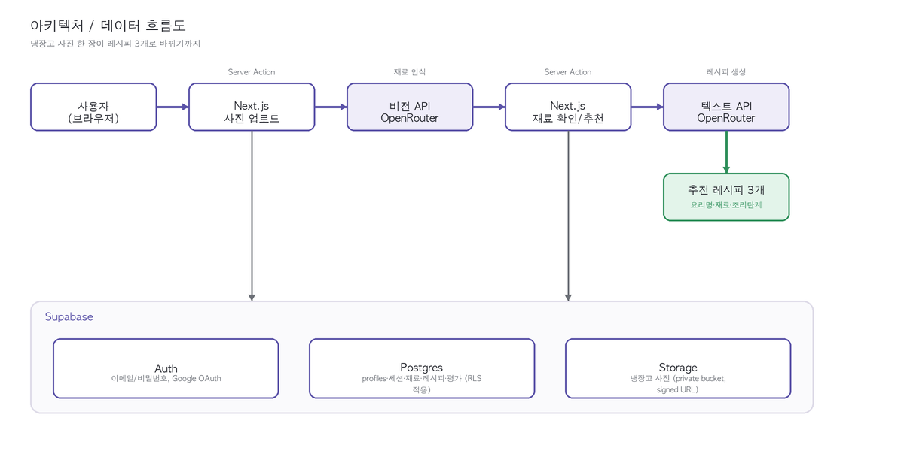

# PRD: recipe4fridge_pic

## 1. 개요

냉장고 사진을 업로드하면 AI가 식재료를 인식하고, 사용자의 선호 조건을 반영해 레시피를 추천하는 웹 앱.

- **비전 AI**: 사진 → 식재료 종류/양 추정
- **텍스트 AI**: 식재료 + 선호 조건 → 레시피 추천
- **인증**: 회원가입/로그인 후 이용, 선호 조건과 추천 기록을 계정에 저장



## 2. 목표와 범위

| 구분 | 포함 |
|---|---|
| 목표 | 사진 몇 장으로 "오늘 뭐 해먹지"에 대한 실용적 답을 빠르게 제공 |
| 비목표 (초기 범위 제외) | 정확한 칼로리 계산, 재고 관리(유통기한 알림 등), 모바일 네이티브 앱 |

## 3. 기술 스택

- **프론트/백엔드**: Next.js (App Router), Vercel 배포 (GitHub 연동, main 브랜치 push마다 자동 배포)
- **인증/DB/스토리지**: Supabase (Auth, Postgres, Storage)
- **AI 연동**: OpenRouter 무료(`:free`) 모델을 실제로 호출. 비전/텍스트 각각 모델 3개를 드롭다운에 노출하고, 사용자가 직접 선택 가능. 개발 초기에 쓰던 mock 구현은 파일로 남겨두되(수업용 "가짜 로직 vs 실제 API" 비교 자료) 실사용자 선택 목록에서는 제외
- **CI/CD**: GitHub 저장소 연동 + Vercel 자동 배포 — **완료, 실제 배포 URL로 접속 가능**

## 4. 사용자 흐름

1. **가입/로그인** — Google OAuth 또는 이메일/비밀번호 (Supabase Auth)
2. **선호 조건 설정** (최초 1회, 이후 마이페이지에서 수정) — 요리 종류(한식/양식/중식/일식), 매운맛 선호도, 조리 난이도, 조리 소요 시간 등
3. **냉장고 사진 업로드** — 이미지 1~3장 업로드 (용량이 크면 자동 축소 후 전송). 실제 API 호출은 응답까지 시간이 걸려서 업로드 버튼에 대략적인 소요 시간 안내와 진행 스피너를 추가
4. **식재료 인식 결과 확인** — 인식된 식재료 목록(종류/수량 추정치) 표시, 사용자가 추가/수정/삭제 가능
5. **레시피 추천 요청** — 확정된 식재료 + 선호 조건으로 레시피 3개 추천받음. 이 화면에서 요리 종류/매운맛/난이도/시간 값을 "이번 요청에 한해서만" 임시로 바꿔 재요청 가능 (계정의 기본 선호 조건은 변경되지 않음)
6. **레시피 상세 확인, 평가, 저장** — 레시피별로 좋아요/싫어요와 평가 코멘트 남기기, 마음에 드는 레시피는 계정에 저장, 이후 "추천받았던 레시피" 목록에서 재확인

## 5. 기능 요구사항

### 5.1 인증 및 회원 관리
- Google OAuth 로그인
- 이메일/비밀번호 회원가입, 로그인, 로그아웃
- 비밀번호는 Supabase Auth가 관리 (직접 저장/해싱하지 않음)

### 5.2 선호 조건 (사용자 프로필)
- 요리 종류 (한식/양식/중식/일식 중 **단일 선택**)
- 매운맛 선호도 (예: 안 매움/보통/매움)
- 조리 난이도 선호 (쉬움/보통/어려움)
- 조리 소요 시간 선호 (예: 15분 이내/30분 이내/제한 없음)
- 디자인 테마 선택 (3종 중 택1)
- 계정 기본값과 별개로, 레시피 추천 화면에서 **이번 세션에 한해** 위 조건들을 임시로 덮어써서 재요청 가능 (세션 오버라이드)

### 5.3 식재료 인식
- 이미지 업로드 (jpg/png), 최대 3장까지 업로드 가능 (누적 선택 지원)
- 클라이언트에서 업로드 전 이미지 용량이 크면 자동 축소(리사이즈/압축) 후 전송
- **여러 장을 업로드해도 하나로 합치지 않고, 각 이미지를 signed URL 그대로 비전 API에 1회 호출로 함께 전달** (그리드 이어붙이기는 채택하지 않음 — 실제 멀티모달 모델이 여러 이미지를 그대로 받을 수 있어 불필요했음)
- 선택된 비전 API(OpenRouter) 호출 → 식재료명 + 추정 수량 목록 반환
- **1순위 모델이 무료 한도 초과·오류로 응답하지 못하면 자동으로 다음 모델로 재시도** (최종 안전망은 `openrouter/free` — 그 순간 살아있는 무료 모델로 자동 라우팅)
- 작은 무료 모델이 같은 재료를 반복 응답하는 문제를 감지해 안전망으로 넘기는 검증 로직 추가
- 인식된 재료가 0개로 실패하면 재시도를 유도하는 흐름 추가
- 인식 결과에 대한 수동 추가/수정/삭제 UI
- 비전 API 제공처를 업로드 화면에서 직접 선택 가능 (모델 3개 + 자동선택 옵션)

### 5.4 레시피 추천
- 확정된 식재료 목록 + 선호 조건(또는 세션 오버라이드 값)을 프롬프트로 구성해 텍스트 API(OpenRouter) 호출
- 기본 3개 레시피 추천, "다른 레시피 더 보기(재요청)" 버튼으로 추가 요청 가능
- 레시피 결과: 요리명, 필요 재료, 조리 단계, 예상 소요 시간 포함
- 텍스트 API 제공처를 재료 확인 화면에서 직접 선택 가능 (첫 생성 시점부터 선택 반영)
- 모델이 JSON을 설명 문장과 함께 반환해도 첫 번째 균형 잡힌 `[...]`/`{...}` 부분만 추출해 재파싱하도록 응답 파싱을 관대하게 처리
- 추천 결과 저장 (즐겨찾기), 저장 목록 조회/삭제

### 5.5 디자인 테마
- 3개 테마 모두 구현하여 마이페이지에서 자유롭게 선택/변경 가능
  - `apricot` (달콤 살구) — 비대칭 라운드 + 코랄 포인트
  - `greens` (프레시 그린스) — 마켓 태그 스타일 + 그린 포인트
  - `bakery` (선샤인 베이커리) — 스캘럽 카드 + 버터옐로우/네이비
- 기본값은 `apricot`. 로그인 전 화면(로그인/가입/이메일 확인 안내)에도 기본 테마 적용

### 5.6 레시피 평가 및 관리자 집계
- 사용자는 추천받은 레시피마다 좋아요/싫어요와 평가 코멘트(텍스트)를 남길 수 있음
- 평가는 저장 여부와 무관하게 남길 수 있음
- 관리자 계정(`profiles.is_admin = true`)은 별도 대시보드에서 레시피별/기간별 좋아요·싫어요 비율과 코멘트 목록을 집계 조회 가능
- 관리자 대시보드는 일반 사용자에게는 노출되지 않음

## 6. 데이터 모델 (초안)

```
users                (Supabase Auth 기본 제공 테이블 사용)

profiles             id(=user_id, FK), cuisine_type, spice_level, difficulty, time_limit,
                     theme(enum: apricot/greens/bakery, default apricot),
                     is_admin(bool, default false), created_at

fridge_sessions      id, user_id(FK), vision_provider, created_at

fridge_images        id, session_id(FK), image_url, original_size_bytes,
                     resized(bool), display_order

detected_ingredients id, session_id(FK), name, quantity_text, is_user_edited

recipe_requests      id, session_id(FK), user_id(FK), text_provider,
                     cuisine_override, spice_override, difficulty_override, time_override,
                     requested_count, created_at

recipes              id, request_id(FK), title, ingredients_json, steps_json,
                     est_time_minutes, created_at

saved_recipes        id, user_id(FK), recipe_id(FK), saved_at

recipe_feedback      id, recipe_id(FK), user_id(FK), reaction(enum: like/dislike),
                     comment_text, created_at
```

## 7. API / AI 연동 설계

- **추상화 계층**: `VisionProvider` / `TextProvider` 인터페이스 뒤에 실제 구현을 연결
  - `OpenRouterVisionProvider`, `OpenRouterTextProvider` — **실제 OpenRouter API를 호출하는 정식 구현으로 교체 완료**
  - `MockVisionProvider`/`MockTextProvider`는 파일로 남겨뒀지만 실사용자 선택 목록(registry)에서는 제외 — API 키 없이 개발하던 시절의 흔적을 수업 자료로 남겨둔 것
- **API 키 관리**: 서버 환경변수(`OPENROUTER_API_KEY` 등)로 보관, 클라이언트에 절대 노출 금지
- **요청 흐름**: 클라이언트 → Next.js Server Action → 선택된 Provider 호출 → 결과 정규화 후 응답
- **실패 처리 (완료)**:
  - 1순위 모델 실패 시 다음 후보 모델로 자동 재시도(fallback), 최종 안전망은 `openrouter/free`
  - 무료 모델 특유의 "같은 응답 반복" 실패 패턴을 감지해 안전망으로 전환
  - 응답이 오래 걸릴 수 있어 서버리스 함수 제한 시간을 늘리고(`maxDuration`), 버튼에 진행 스피너 + 예상 소요 시간 안내 표시

### 7.1 실제 연동된 무료 API (OpenRouter)

> 2026-07-15 실사용 테스트 기준. OpenRouter 무료 라인업은 자주 바뀌므로, 잘 알려진 인기 모델은 무료 엔드포인트가 먼저 막히는 경향을 확인하고 상대적으로 덜 알려진 모델을 우선순위 앞쪽에 배치했다.

**비전(이미지 인식)**
1. `google/gemma-4-26b-a4b-it:free`
2. `nvidia/nemotron-nano-12b-v2-vl:free`
3. `google/gemma-4-31b-it:free`
4. `openrouter/free` (자동 선택 — 그 순간 살아있는 무료 모델로 라우팅, 안전망 겸용)

**텍스트(레시피 생성)**
1. `nvidia/nemotron-3-super-120b-a12b:free`
2. `qwen/qwen3-next-80b-a3b-instruct:free`
3. `cognitivecomputations/dolphin-mistral-24b-venice-edition:free`

## 8. 비기능 요구사항

### 8.1 보안
- API 키 등 민감정보는 서버 사이드에서만 사용
- Supabase RLS로 사용자 데이터 접근 제어 (자신의 데이터만 조회/수정 가능)
- 업로드 이미지 용량/형식/개수(최대 3장) 서버 재검증
- 인증 토큰 만료/재발급 처리
- 관리자 대시보드는 `profiles.is_admin` 확인을 서버에서 강제
- 주요 위협 요소 점검 완료: 인증 우회, 악성 파일 삽입, API 키 노출, rate limiting, XSS

### 8.2 성능/비용
- 무료 API 티어 한도 내에서 동작하도록 호출 횟수 최소화
- 모델별 요청에 타임아웃을 걸어 무한 대기 방지

### 8.3 접근성/반응형
- 모바일/데스크톱 반응형 레이아웃 (모바일 내비게이션 줄바꿈 버그 수정 완료)
- 기본 대비/폰트 크기 등 접근성 고려

## 9. 마일스톤

1. **PRD 확정** — 완료
2. **디자인 시안 2~3종 확정** — 완료
3. **MVP**: mock 파이프라인 동작 확인 — 완료
4. **인증 + 개인화** — 완료
5. **API 다중 선택 UI** — 완료
6. **보안 점검 및 대응 구현** — 완료
7. **배포**: GitHub 연동 + Vercel 배포 — **완료**
8. **문서화**: 기획/설계/개발/보완 과정 정리, 강의용 도식 포함 — 진행 중
9. *(추가)* **실제 OpenRouter 연동 + 안정화** — **완료 (이 문서 시점)**: mock → 실제 API 교체, 자동 fallback, 반복-응답 감지, 관대한 JSON 파싱, 진행 상태 UX

## 10. 미결정/확인 필요 사항

### 해결됨
- ~~이미지 자동 축소의 목표 해상도/용량 기준치~~ → 긴 변 1600px, JPEG 품질 0.82
- ~~요리 종류 다중 선택 허용 여부~~ → 단일 선택
- ~~관리자 계정 부여 방식~~ → 수동 DB 플래그
- ~~7.1의 후보 중 실제 사용 가능한 모델명~~ → 위 7.1에 실제 모델 ID 확정 반영
- ~~여러 장의 사진을 합치는 방식~~ → 합치지 않고 각 이미지를 signed URL로 그대로 함께 전달하는 방식으로 결정

### 아직 남음
- 배포 후 실사용 트래픽 기준 무료 API 한도/응답시간 재검증
